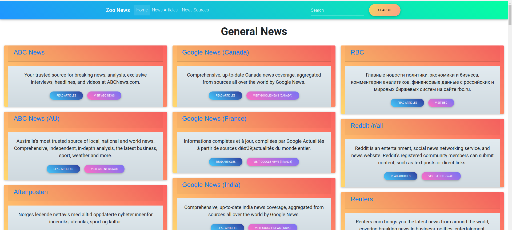

# Python_News_Updates
[](https://www.python.org/)

This is a flask application that will help people list and preview news articles from various sources. Using the News Api


## Project Objectives

* Your project should contain two models, one for the news source and one for the news article.
* Your project must use views and routes.
* Your project should consume the News API.
* Your project must contain request(s) to the News API.
* Your project should follow the proper folder structure.
* Your application should be deployed to Heroku.

## Technical Requirements

1. The project should have a specs markdown file that displays the project's specifications. :heavy_check_mark:
2. The model classes should have unittests to check for behaviour. The tests should pass. :heavy_check_mark:
3. The project needs to be deployed to Heroku. :heavy_check_mark:
4. The project should have clear commit messages. :heavy_check_mark:
5. The project should be polished in a portfolio-quality state. :heavy_check_mark:

## Showcase


## Live Site
[link to deployed site](https://zoo-news.herokuapp.com/)

## Setup Instructions / Installation
### Getting Started
This app utilizes the [News API](https://newsapi.org/) to retrieve news sources and articles. 
Inorder to properly run this app: 
 1. Go to [News API](https://newsapi.org) and create an account or login.
 2. Get your Api key
### Prerequisites 
- Python and pip (I am currently using 3.9.6) Any version above 3.5 should work.
- News Api key 
- Git installed on your machine 
- Code editor/ IDE 
### Installation and Running the App
1. Clone GitHub repository
    ```shell
    git clone https://github.com/KenMwaura1/Python_News_Updates
    ```
2. Change into the folder
    ```shell
   cd Python_News_Updates
    ```
3. Create a virtual environment
   ```shell
      python3 -m venv venv 
   ```
   - Activate the virtual environment

     `source ./bin/activate`

   * If you are using [pyenv](https://github.com/pyenv/pyenv)

      3a. Create a virtualenv
   
      ```
          pyenv virtualenv python_news_updates
      ```
      3b. Activate the virtualenv
   
      ```
      pyenv activate python_news_updates
      ```
4. Create a `.env` file and add your credentials

   ```
   touch .env 
   ```

    OR Copy the included example
    
    ``` 
    cp .env-example .env 
    ```
5. Add your credentials to the `.env` file
6. Install the required dependencies
   ```shell
   pip install -r requirements.txt
   ```
7. Make the shell script executable
    ```shell
   chmod a+x ./start.sh
    ```
8. Run the app
    ```shell
   ./start.sh
    ```
   OR 
    run with the [flask-cli](https://flask.palletsprojects.com/en/2.0.x/cli/)
    ```shell
   flask run
    ```

## Tests 
* To run the tests:
    ```shell 
  flask tests
    ```

## Technologies used

* Python-3.9.6
* Flask web framework
* Bootstrap(Material Bootstrap 4)
* HTML5
* CSS3

## Author

[Ken Mwaura](https://github.com/KenMwaura1)

## LICENSE

MIT License

Copyright (c) 2021 Kennedy Ngugi Mwaura

Permission is hereby granted, free of charge, to any person obtaining a copy
of this software and associated documentation files (the "Software"), to deal
in the Software without restriction, including without limitation the rights
to use, copy, modify, merge, publish, distribute, sublicense, and/or sell
copies of the Software, and to permit persons to whom the Software is
furnished to do so.
